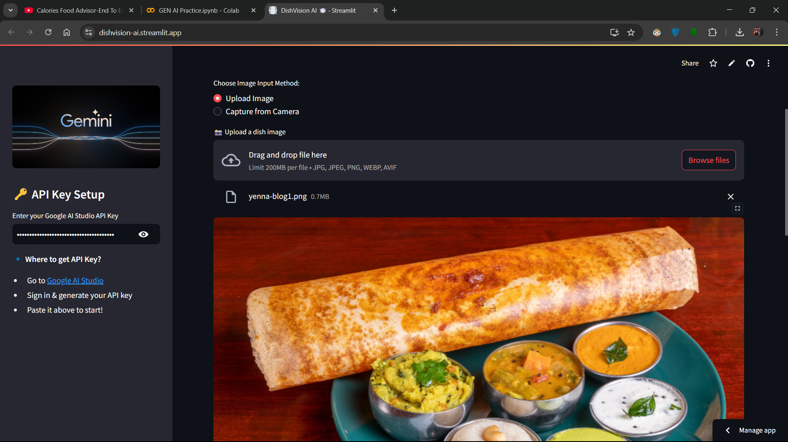

# 🍽️ DishVision AI - Advanced Dish Detection using AI

DishVision AI is a **Streamlit-powered web app** that uses **Google Gemini AI** to analyze food images and provide:  
✅ Dish Name  
✅ Ingredients with quantities  
✅ Step-by-step Recipe  

Snap a dish or upload an image and get instant recipe recommendations! 🚀  

---

## 📌 Table of Contents
- [Features](#features)
- [Installation](#installation)
- [Usage](#usage)
- [Screenshot](#screenshot)
- [Contributing](#contributing)
- [License](#license)

---

## 🚀 Features
✔️ Upload or capture a food image  
✔️ AI-powered dish name detection  
✔️ Ingredients list with quantities  
✔️ Step-by-step cooking recipe  
✔️ Simple and user-friendly UI  

---

## 🛠️ Installation

### 1️⃣ Clone the Repository
```bash
git clone https://github.com/abhi227070/DishVision-Multimodal.git
cd DishVision-Multimodal
```
### 2️⃣ Create a Virtual Environment (Optional but Recommended)
```bash
python -m venv env
source env/bin/activate  # On Windows: env\Scripts\activate
```
### 3️⃣ Install Requirements
```bash
pip install -r requirements.txt
```
### 4️⃣ Run the App
```bash
streamlit run app.py
```

## 🎯 Usage
1️⃣ **Enter your Google AI Studio API Key** in the sidebar.  
2️⃣ **Choose an image input method** – Upload a dish image or capture using a camera.  
3️⃣ **Wait for AI processing** – The app will analyze and provide dish details.  
4️⃣ **Enjoy your recipe! 🍳**  

---

## 📸 Screenshot
  

---

## 🤝 Contributing
Want to improve **DishVision AI**? Feel free to **fork** this repo, create a new branch, and submit a **Pull Request (PR)**.  
1. **Fork the repository**  
2. **Create a new branch** (`git checkout -b feature-branch`)  
3. **Make changes and commit** (`git commit -m "Add new feature"`)  
4. **Push to your branch** (`git push origin feature-branch`)  
5. **Submit a pull request**  

We appreciate your contributions! 🚀  

---

## 📜 License
This project is licensed under the **MIT License**.  
See the [LICENSE](LICENSE) file for details.  
